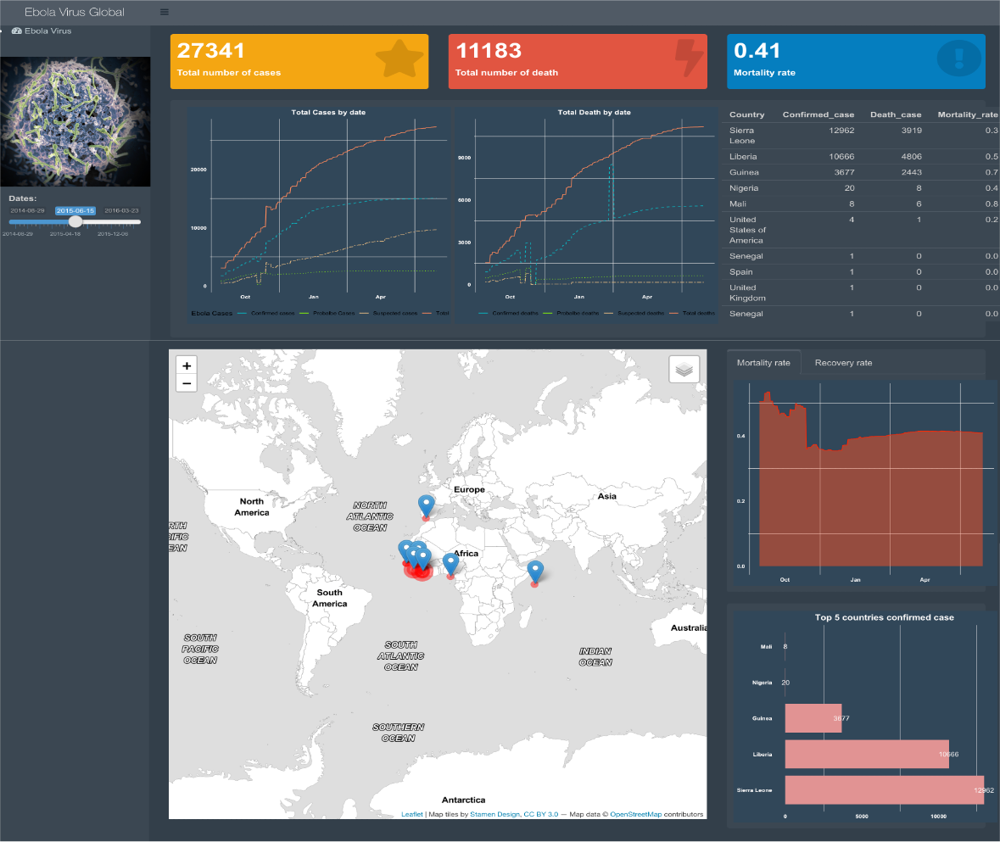

## **Problem Statement:**

Use the “ebola_2014_2016.csv” file to create a Shiny app that summarizes information about the Western African Ebola virus epidemic. 

### **This project shows as follow:**

1. The spread of the virus over time
2. The distribution of the virus across countries on a map
3. The fatality and recovery rate of those infected by the virus

